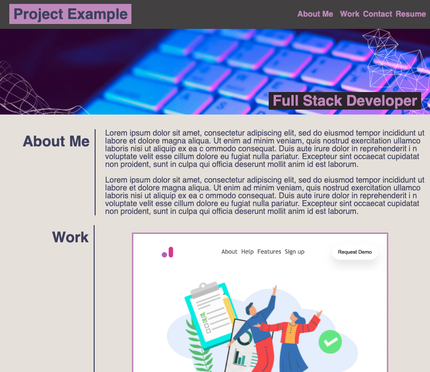

# css_Portfolio

### _This application is a starter, static portfolio page built from scratch._

## Table of Contents

- [Media](#Media)

- [Deployed Site](#deployed-site)

- [Features](#Features)

- [Contributors](#Contributors)

- [Contact](#Contact)

- [Project Status](#project-status)

- [License](#License)

## Media

## Deployed Site

   [The correct link is coming soon. In the meantime, play this game I built.](https://celestealexmoore.github.io/Rock-Paper-Scissors/)

## Features
    - Flexbox
    - Media Queries
    - CSS Variables

## Contributors

This application was created by Celeste Moore.

## Contact

If you have any questions about this repository, contact celestealexmoore via GitHub or reach out via email:
celestealexmoore@gmail.com.

## Project Status

In Progress

---

## License

© 2021 _celestealexmoore_