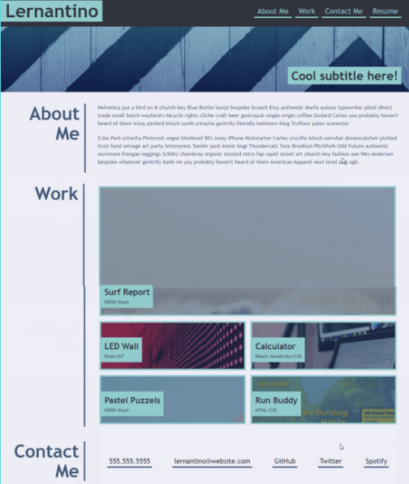

# css_Portfolio

### _This application is a starter, static portfolio page built from scratch._

## Table of Contents

- [Media](#Media)

- [Deployed Site](#deployed-site)

- [Features](#Features)

- [Contributors](#Contributors)

- [Contact](#Contact)

- [Project Status](#project-status)

- [License](#License)

## Media

Example Image to Replicate:  

  

What I've produced:  

  

## Deployed Site

   [Here is the link to the deployed application.](https://celestealexmoore.github.io/css_Portfolio/)

## Features
    - Flexbox
    - Media Queries
    - CSS Variables

## Contributors

This application was created by Celeste Moore.

## Contact

If you have any questions about this repository, contact celestealexmoore via GitHub or reach out via email:
celestealexmoore@gmail.com.

## Project Status

Completed

---

## License

© 2021 _celestealexmoore_